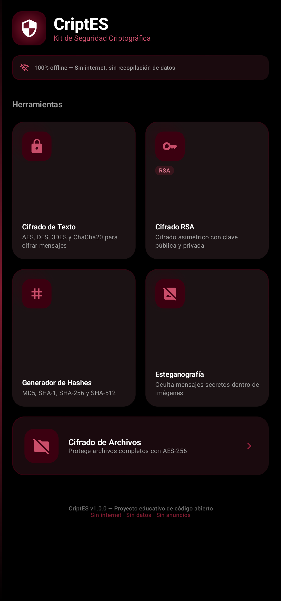
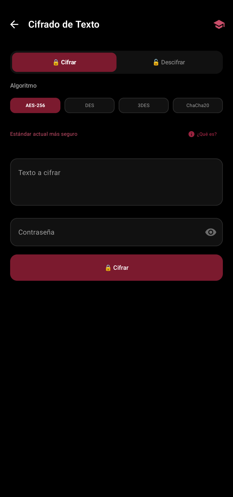
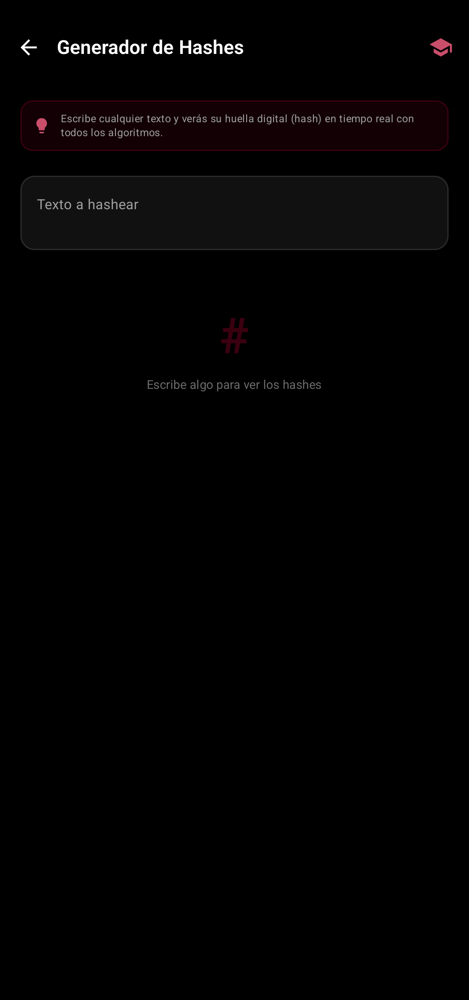
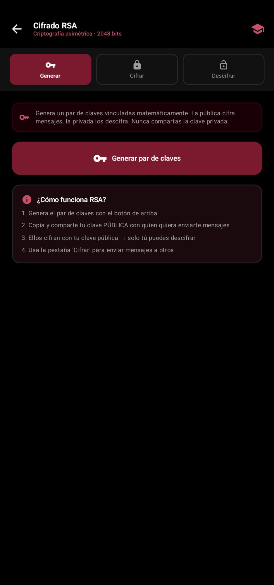

# 🔐 CriptES — Kit de Seguridad Criptográfica para Android

<div align="center">

[](https://github.com/borjaiturregui/CriptES/releases/latest)
[](https://kotlinlang.org)
[](https://developer.android.com/compose)
[](LICENSE)
[](https://developer.android.com)
[](https://github.com/borjaiturregui/CriptES/releases/latest)

**Aplicación Android de criptografía, hashing y esteganografía — completamente en español.**

*Construida con curiosidad, pasión por la seguridad y Jetpack Compose.*

[📲 Descargar APK](https://github.com/borjaiturregui/CriptES/releases/latest) · [🐛 Reportar bug](https://github.com/borjaiturregui/CriptES/issues) · [💡 Sugerir función](https://github.com/borjaiturregui/CriptES/issues)

</div>

---

## 📸 Capturas de Pantalla

<div align="center">

| Pantalla Principal | Cifrado de Texto | Generador de Hashes | Cifrado RSA |
|:---:|:---:|:---:|:---:|
|  |  |  |  |
| Menú con todas las herramientas | AES, DES, 3DES y ChaCha20 | MD5, SHA-1, SHA-256, SHA-512 | Clave pública/privada 2048 bits |

</div>

---

## ✨ ¿Qué es CriptES?

**CriptES** es una navaja suiza de seguridad digital para Android. Nació como un proyecto personal de aprendizaje sobre criptografía y seguridad informática. No solo es una herramienta — cada función viene acompañada de un **modo educativo** que explica cómo funciona el algoritmo por dentro.

> 💡 *Aprende criptografía haciendo criptografía.*

---

## 📱 Funcionalidades

<table>
<tr>
<td width="50%">

### 🔒 Cifrado Simétrico de Texto
Cifra y descifra mensajes con los algoritmos más usados en la industria:
- **AES-256** — El estándar más seguro actual
- **DES** — Clásico, ahora considerado débil
- **3DES** — Mejora de DES con triple aplicación
- **ChaCha20** — Moderno, usado en TLS 1.3

</td>
<td width="50%">

### 🔑 Cifrado Asimétrico RSA
Criptografía de clave pública/privada:
- Generación de par de claves 2048 bits
- Cifrado con clave pública
- Descifrado con clave privada
- Exportación en formato PEM estándar

</td>
</tr>
<tr>
<td width="50%">

### #️⃣ Generador de Hashes
Genera huellas digitales criptográficas:
- **MD5** — Rápido, no recomendado para seguridad
- **SHA-1** — Obsoleto pero ampliamente estudiado
- **SHA-256** — Estándar actual (Bitcoin lo usa)
- **SHA-512** — Máxima seguridad en hashing

</td>
<td width="50%">

### 🖼️ Esteganografía *(próximamente v1.2)*
Oculta mensajes dentro de imágenes:
- Técnica LSB (Least Significant Bit)
- Compatible con PNG y JPG
- Sin alteración visual detectable

</td>
</tr>
<tr>
<td width="50%">

### 📁 Cifrado de Archivos *(próximamente v1.3)*
Protege archivos completos con AES-256:
- Compatible con cualquier tipo de archivo
- Archivos guardados en `Descargas/criptes/`
- Descifrado con la misma contraseña

</td>
<td width="50%"></td>
</tr>
</table>

### 📖 Modo Educativo
Cada módulo incluye una explicación completa en español: historia del algoritmo, cómo funciona matemáticamente, casos de uso reales y sus fortalezas y debilidades.

---

## ⚡ Instalación rápida

### Opción A — Descargar APK directamente *(recomendado)*

1. Ve a [**Releases**](https://github.com/borjaiturregui/CriptES/releases/latest)
2. Descarga el archivo `CriptES-vX.X.apk`
3. Abre el archivo en tu Android
4. Si aparece un aviso: **Ajustes → Instalar apps desconocidas → Permitir**
5. ¡Listo! 🎉

> ⚠️ Requiere Android 8.0 (API 26) o superior

### Opción B — Compilar desde el código fuente

```bash
# Clonar el repositorio
git clone https://github.com/borjaiturregui/CriptES.git

# Abrir en Android Studio
cd CriptES

# Instalar en dispositivo o emulador
./gradlew installDebug
```

**Prerrequisitos:** Android Studio Hedgehog (2023.1.1)+, JDK 17+, Android SDK API 26+

---

## 🏗️ Arquitectura

El proyecto sigue **Clean Architecture** con separación clara de responsabilidades:

```
com.criptes.app/
├── MainActivity.kt
├── ui/
│   ├── tema/               # Colores, tipografía y tema oscuro
│   │   ├── Colores.kt
│   │   ├── Tema.kt
│   │   └── Tipografia.kt
│   ├── navegacion/         # Rutas y grafo de navegación
│   │   └── Navegacion.kt
│   └── pantallas/          # Pantallas principales con ViewModels
│       ├── PantallaInicio.kt
│       ├── PantallaCifradoTexto.kt
│       ├── PantallaCifradoRSA.kt
│       ├── PantallaGeneradorHash.kt
│       ├── PantallaEducativa.kt
│       └── PantallasStub.kt
├── dominio/
│   └── modelos/            # Modelos de datos
│       └── ContenidoEducativo.kt
└── criptografia/           # Motor criptográfico
    ├── CifradoSimetrico.kt # AES, DES, 3DES, ChaCha20
    ├── CifradoRSA.kt       # RSA 2048 bits con OAEP
    ├── GeneradorHash.kt    # MD5, SHA-1, SHA-256, SHA-512
    └── Esteganografia.kt   # LSB en imágenes
```

**Patrones aplicados:** MVVM · Clean Architecture · SOLID · Coroutines + Flow

---

## 🎨 Diseño

CriptES tiene una identidad visual propia: **negro puro + rojo vino**. El tema oscuro no es una opción, es la identidad de la app.

| Elemento | Color | Hex |
|---|---|---|
| Fondo principal | ⬛ Negro puro | `#000000` |
| Superficie cards | ⬛ Negro profundo | `#111111` |
| Color primario | 🟥 Rojo vino | `#7B1A2E` |
| Acento | 🟥 Rojo vino claro | `#B22948` |
| Texto principal | ⬜ Blanco | `#FFFFFF` |
| Texto secundario | 🔲 Gris suave | `#9E9E9E` |

---

## 🛡️ Privacidad y Seguridad

| ✅ | Característica |
|---|---|
| ✅ | **Sin permisos de internet** — Todo funciona 100% offline |
| ✅ | **Sin recopilación de datos** — Tu información nunca sale del dispositivo |
| ✅ | **Sin anuncios** — Proyecto completamente limpio |
| ✅ | **Código abierto** — Auditable por cualquiera en cualquier momento |
| ✅ | **Sin telemetría** — Cero rastreo de uso |

---

## 📚 Stack Tecnológico

| Librería | Versión | Uso |
|---|---|---|
| Jetpack Compose BOM | 2024.06.00 | UI declarativa moderna |
| Kotlin | 1.9.25 | Lenguaje principal |
| Navigation Compose | 2.7.7 | Navegación entre pantallas |
| Coroutines | 1.8.0 | Operaciones asíncronas |
| Bouncy Castle | 1.77 | Motor criptográfico avanzado |

---

## 🛣️ Roadmap

- [x] **v1.0** — Cifrado simétrico (AES-256, DES, 3DES, ChaCha20)
- [x] **v1.0** — Generador de hashes (MD5, SHA-1, SHA-256, SHA-512)
- [x] **v1.0** — Modo educativo en español
- [x] **v1.1** — Cifrado RSA (clave pública/privada 2048 bits)
- [ ] **v1.2** — Esteganografía LSB en imágenes
- [ ] **v1.3** — Cifrado de archivos con AES-256
- [ ] **v1.4** — Generador de contraseñas seguras

---

## 🤝 Contribuir

Las contribuciones son bienvenidas. Si encuentras un bug o tienes una idea:

1. Haz un **Fork** del proyecto
2. Crea una rama: `git checkout -b feat/nueva-funcion`
3. Haz commit: `git commit -m "feat: añadir nueva función"`
4. Push: `git push origin feat/nueva-funcion`
5. Abre un **Pull Request**

---

## 🧠 ¿Por qué lo hice?

Quería entender la criptografía de verdad, no solo leer sobre ella. Este proyecto es mi laboratorio personal donde pongo en práctica conceptos de seguridad informática mientras aprendo Android con Jetpack Compose.

---

## 📄 Licencia

Este proyecto está bajo la licencia **MIT** — úsalo, modifícalo y compártelo libremente.

Ver el archivo [LICENSE](LICENSE) para más detalles.

---

<div align="center">

Hecho con 🖤 y mucha curiosidad criptográfica 🔐

**[borjaiturregui](https://github.com/borjaiturregui)**

</div>
